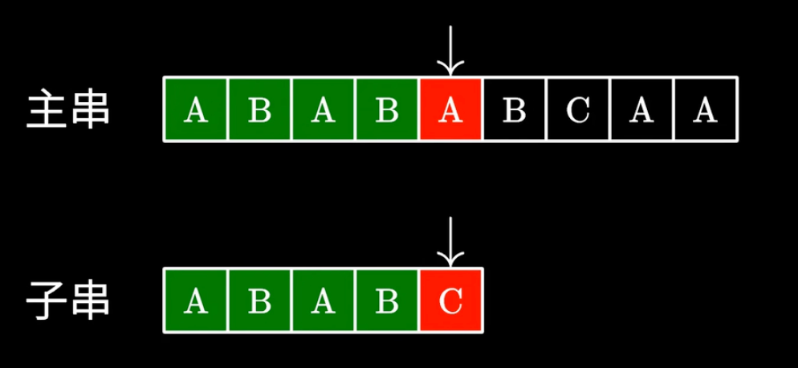
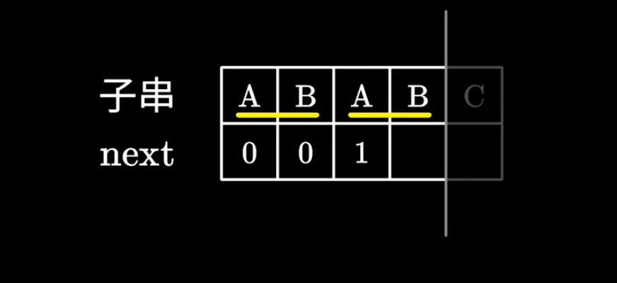
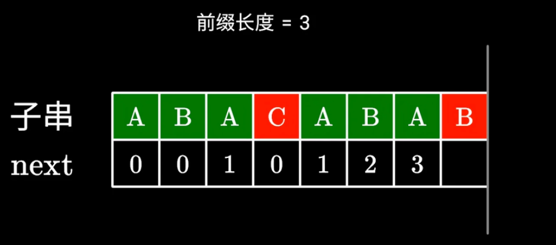

## 问题定义

今天我们有一个比较长的字符串S，还有一个等待匹配的字符串pattern。我们需要判断S中是否有pattern。一个朴素的想法是使用双指针进行匹配，当无法匹配的时候，我们就让S的指针从下一个位置开始，然后从头开始匹配。显然，这种方法的时间复杂度是O(m * n)。




## KMP优化

KMP引入了一个next数组，next数组的含义是：当前pattern串匹配的位置，最长的前缀=后缀的长度。举个例子，对于ABAB的匹配串，我们可以知道next = 2。那么当ABAB的下一个字符C不匹配的时候，我们可以让字串不要从0开始匹配，而是从2开始继续匹配。因为移动后，原来的匹配关系就刚好变成了之前匹配串的前缀与后缀的匹配。伪代码如下：

```cpp

vector<int> next = build_next(pattern);

int m = s.size();
int n = pattern.size();
int i = 0, j = 0;

while(i < m){

    if(s[i] == pattern[j]){
        i ++;
        j ++;
    }else{
        
        if(j > 0)j = next[j - 1];
        else i ++;
    }
    
    if(j == n){
        // 匹配完全了
    }

}
```

## 如何求next数组

next[i]的含义其实就是：以pattern[i]为结尾的字符串的最长的前缀 = 后缀的长度(前提是必须小于字符串长度)。如下图所示，当我们计算B这个位置的next的时候，其实是要先看前面的元素的next，然后再匹配。匹配有两种可能：

1. B和B匹配上了，next++
2. B和C没有匹配上。此时我们想要寻找一个新的后缀比ABA更短的后缀，使得他和前缀相同，这样我们可以继续做匹配。由于右边的ABA的后缀其实就是左边的ABA的后缀。所以其实我们是要找在前面的ABA中，后缀等于前缀的一个长度。那其实就是拿到与之对称的位置的next即可。这里其实就是next[len]




```cpp

vector<int> build_next(string pattern){

    int m = pattern.size();
    vector<int> next(m, 0);
    
    int i = 1;
    int pre_len = 0;
    while(i < m){

        if(pattern[pre_len] == pattern[i]){
            next[i] = pre_len + 1;
            i ++;
        }else{
            if(pre_len > 0)pre_len = next[pre_len - 1];
            else{
                next[i]  = 0;
                i  ++;
            }
        }


    }
}

```


