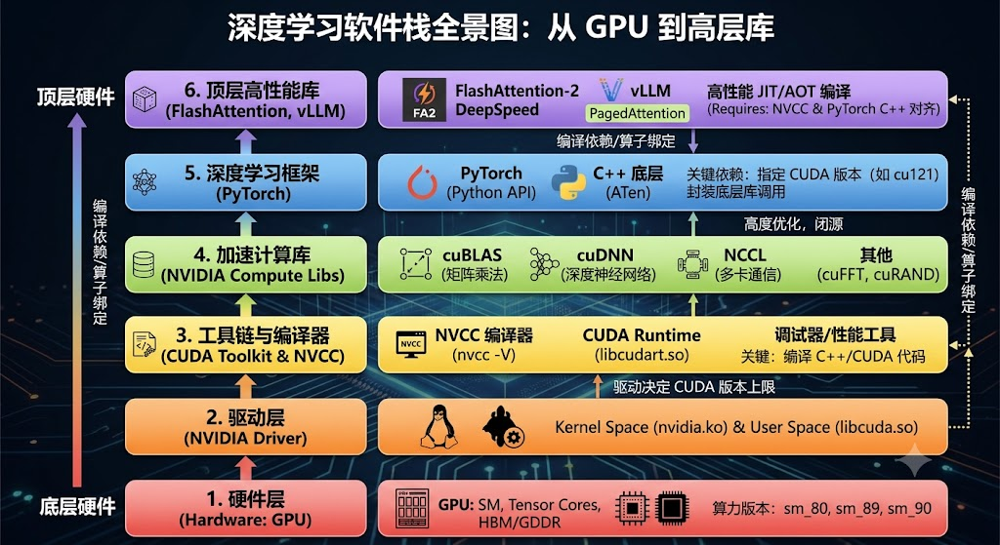

## Python运行原理

Python 经常被大家称作是一门解释型语言，但真实情况似乎不是这样。

Python 内部其实有一个编译器，能把 Python 代码转成 .pyc 文件。这种 .pyc 文件的字节码是跨平台的，只要目标机器上有 Python 解释器就可以运行。

这一点跟 Java 很像（Java 的运行也需要 JVM），而相比于 C++，主要区别就是它需要这个解释器。

此外，关于编译器（也就是把 .py 文件编译成 .pyc 文件的东西），其实有很多种：

1. CPython：是用 C 语言编写的
2. PyPy

我们默认的 Python 其实用的就是 CPython 这样的一个编译器


另外，大家肯定都听说过 Python 的运行速度很慢，这到底是为什么呢？

主要原因是因为全局解释器锁（GIL）的存在。对于 CPython 解释器来说，在同一个进程内部，不管你有多少个线程，同一时刻只能有一个线程在执行 Python 的字节码。

相比之下：
1. C++ 和 Java
   (a) 在同一个进程当中，C++ 可以同时执行多个线程，利用 CPU 的多个核心。
   (b) Java 也是一样，它的多线程可以并行在 CPU 上运行。
   (c) 这些语言只需要通过一些并发设计，比如 Java 的 JUC（Java Util Concurrent），或者像 C++ 靠手动加锁和同步机制，就能实现真正的多线程并行。

2. Python
   (a) 因为有 GIL 的存在，即使你开了很多个线程，执行效率依然很低，无法实现真正的多线程并行。
   (b) 它的解决方案其实是多进程，即直接开启多个进程。
   (c) 每个进程都有自己独立的 GIL，互不影响。

但需要注意的是，进程之间的通信比线程之间的通信要慢得多。其他语言之所以使用多线程，是因为线程的开销比较小（比较“便宜”），但对 Python 来说，由于无法高效利用多线程，只能通过多进程来解决，所以整体还是显得比较慢。


## Python Library

我们知道，一门语言之所以能够经久不衰，或者受到大家广泛的使用，核心就在于它的可拓展性。也就是说，你可以引入不同的 package 和 library，通过别人写好的库来实现各种功能。

比如在 C++ 里面，你可以引入别人的头文件并找到对应的代码来运行；在 Java 里面，你可以下载对应的 jar 包，同样是通过 package 的机制来操作；在 Python 里面也是一样的。

不过在 Python 当中，library 的加载机制比较动态：它会从一个 sys.path 列表当中去寻找 package。默认情况下，它会依次查找四个地方：
1. 当前运行脚本的目录
2. 环境变量 PYTHONPATH
3. 标准库目录
4. site-packages（即第三方库目录，通常是 pip install 安装的地方）

当我们找到对应的 library 之后，Python 会在内部创建一个 module 对象，并执行该文件里的代码，最后把其中的函数和类挂载到这个对象上面。


假设你有一个库文件 foo.py，内容如下：
```python
# foo.py
print("foo.py 开始执行了！")

x = 10

def bar():
    return "Hello from bar"
```

当你在 main.py 中写下 import foo 时，Python 内部会发生以下三步：


- Python 内部的所有东西都是对象（Object），模块也不例外。Python 在内存中开辟一块空间，创建一个类型为 <class 'module'> 的空对象。这个对象内部自带一个字典（即 __dict__），用来存储这个模块未来所有的变量和函数。


- Python 解释器开始逐行执行 foo.py：遇到 print("foo.py 开始执行了！") $\rightarrow$ 直接在控制台打印输出。遇到 x = 10 $\rightarrow$ 这是一个赋值语句，在当前作用域创建变量 x。遇到 def bar(): ... $\rightarrow$ 这是一个函数定义语句，在内存中创建一个函数对象。

- Python 会把产生的全局变量、函数名、类名，作为键值对（Key-Value）存入第一步创建的那个 module 对象的 __dict__ 字典中。
```python
foo.__dict__ = {
    '__name__': 'foo',
    'x': 10,
    'bar': <function bar at 0x7f9a...>,  # 指向内存中的函数体
    ...
}
```


最后，Python 在你当前的 main.py 作用域里，创建了一个名为 foo 的变量，让它指向内存中的这个模块对象。

所以，你在 main.py 里调用 foo.bar() 或者 foo.x 时，本质上是通过 foo 这个指针，去它的内层字典（__dict__）里查找键为 'bar' 或 'x' 的对象。


1. 模块只会被执行一次（单例模式）
如果你在 main.py 里写了三次 import foo，里面的 print 语句只会打印一次。
因为 Python 内部有一个全局字典 sys.modules，负责记录所有已经加载过的模块。第二次 import foo 时，Python 发现它已经在 sys.modules 里了，就会直接返回之前创建好的那个对象，不会重新执行一遍代码。

2. 为什么写库时要用 if __name__ == '__main__':？
如果你的 foo.py 里面有一些测试运行的代码，当别人 import foo 时，这些测试代码也会因为“第二步（默默运行一次）”而被触发执行。
为了防止这种情况，我们需要用 if __name__ == '__main__': 把测试代码包起来。因为当它作为库被 import 时，它的 __name__ 属性会被赋值为 'foo' 而不是 '__main__'，这样里面的测试代码就不会被错误执行了


## Deep Learning Package

我相信不少朋友在安装vllm  flash-attention等库的时候都会碰到一些问题。这些深度学习相关的package为什么这么难安装，值的深入讨论一下。我们将先梳理一下AI相关的软件栈，了解不同layer的联系和功能，再深入解读flash-attention等packae为什么这么难安装，最后我们会有一个walkthrough, 讲解如何从0对一台带有GPU的Ubuntu系统进行深度学习环境的配置。

### AI Software Stack



### 1. 硬件层 (Hardware: GPU)
一切的起点是显卡硬件。GPU 内部有数百个流式多处理器（SM），每个 SM 包含大量标量核心（CUDA Cores）和专门加速矩阵乘法的**张量核心（Tensor Cores）**。此外还有高速的片上存储（SRAM/Shared Memory）和片外显存（HBM 或 GDDR）。
* **算力版本 (sm_xx)**：每代架构对应一个算力。例如 Ampere 架构（A100/RTX 3090）是 `sm_80`/`sm_86`，Ada Lovelace 架构（RTX 4090）是 `sm_89`，Hopper 架构（H100）是 `sm_90`。
* **为什么影响安装**：FlashAttention 这种库在编译时，**必须指定特定的算力（如 `TORCH_CUDA_ARCH_LIST=8.0`）**，以便编译器生成能利用该代 Tensor Core 特性（如 Hopper 的 TMA 异步内存拷贝）的二进制机器码。

### 2. 驱动层 (NVIDIA Driver)
驱动是OS与硬件之间的桥梁，可以理解为就是GPU的OS，运行在内核态。驱动在深度学习软件栈中，主要扮演三个角色：
- 内存分配器：分配和管理显卡上的 HBM/GDDR 显存。
- 任务调度器：把你要计算的任务排队送进 GPU 的计算核心（SM）。
- 硬件抽象层：把复杂的硬件寄存器操作，封装成简单的 C 语言 API（即 CUDA Driver API，比如 cuMemAlloc）。


* **核心文件**：在 Linux 上体现为 `nvidia.ko` 内核模块和用户态的动态链接库 `libcuda.so`（CUDA Driver API）。
* **向前兼容性**：**驱动版本决定了你能使用的最高 CUDA Toolkit 版本**。驱动可以向下兼容旧的 CUDA，但绝不能向上兼容。

### 3. 工具链与编译器 (CUDA Toolkit & NVCC)
这是开发者开始接触的层面。CUDA Toolkit 确实可以理解为是一组操作 GPU 的更高层级的 API 和工具箱。
- 编译器 (NVCC)：驱动只认识机器码，它不会编译代码。CUDA Toolkit 里的 nvcc 负责把你的高层 CUDA C++ (.cu .cpp)代码（比如你写的 __global__ void my_kernel()），翻译成驱动能看懂的二进制代码。
- 开发者工具 (Tools)：比如 Nsight Systems、Nsight Compute（性能分析工具）和 cuda-gdb（调试器）。没有这些工具，你根本不知道你的 GPU 为什么跑得慢，或者为什么会报 an illegal memory access was encountered（非法内存访问）。

### 4. 加速计算库 (NVIDIA Compute Libraries)

NVIDIA 针对常见数学运算做到了极致优化的官方闭源库，通常随 CUDA Toolkit 一起安装或作为独立包：

* **cuBLAS**：基础线性代数库（矩阵乘法）。
* **cuDNN**：深度神经网络库（卷积、池化、激活函数等）。
* **NCCL (Nickel)**：多卡/多机通信库（数据并行、张量并行时的 AllReduce 操作）。

### 5. 深度学习框架 (PyTorch)

PyTorch 的本质是一个构建在CUDA Tookit之上的**带有自动求导功能的张量计算引擎**。他做了这几件伟大的事情：

- 动态图与自动求导引擎 (Autograd)
- 聪明的显存池管理 (Caching Allocator)：如果频繁地直接调用 CUDA Toolkit 的 cudaMalloc 和 cudaFree，显卡驱动会频繁地在内核态和用户态之间切换，导致严重的性能卡顿。PyTorch 自己在内存做了一个缓存池。它一次性向驱动申请一大块显存。当你在 Python 里销毁一个 Tensor 时，PyTorch 不会真正释放显存（不调用 cudaFree），而是把它标记为“空闲”，下次你要创建新 Tensor 时直接复用。这极大地加速了显存分配。
- 计算算子的封装：把这些底层的 C 语言加速库，全部打包成了人类一秒就能看懂的 Python 接口。torch.matmul(A, B) 在底层会自动根据你的数据类型、矩阵大小，去匹配并调用 cuBLAS 里面最快的那段核心函数。

### 6. 顶层高性能库 (FlashAttention / vLLM / 三方算子)

* **为什么它们要单独编译？** PyTorch 虽然好，但它是通用框架。为了实现极致的内存优化（如 FlashAttention 减少 HBM 读写）或图优化（如 vLLM 的 PagedAttention），开发者必须用 **C++/CUDA 编写原生 Kernel**。因此，他们就要从头编译，调用 CUDA Toolkit。

就好比 PyTorch 的安装也会带上 CUDA 版本，他们这些库也要根据 CUDA 的版本（包括 NVCC 以及 CUDA Toolkit 的 API 版本）直接进行编译。

当然，你也可以直接使用针对特定环境编译好的 wheel 文件。但问题在于，它们的组合实在是太多了：
1. CUDA 版本
2. NVCC 版本
3. GPU 算力架构
4. Python 版本

甚至有的库还会调用 PyTorch，所以还得结合 PyTorch 的版本。正因为这些都要兼顾，安装起来就比较困难。如果当前环境没有对应的编译好的 wheel 文件，你就得重新编译；而编译过程中只要有一个环节不符合要求，就会报错。

一般来说就这几种报错：

1. 致命的“双 CUDA Toolkit”陷阱（最常见的报错原因）
你的电脑里，往往同时存在两个不同的 CUDA 运行时。

系统 CUDA：你通过 NVIDIA 官网下载并安装在 /usr/local/cuda 的完整工具箱，里面有 nvcc 编译器。

PyTorch 内部 CUDA：你用 pip install torch 时，PyTorch 官方为了省事，自带了一套精简版的 CUDA 动态链接库（比如 libcudart.so），但它没有带 nvcc 编译器。

当 FlashAttention 开始编译时：

它会用你系统的 nvcc（假设是旧的 CUDA 11.8）去编译 CUDA 内核。

编译完后，它需要把这些内核链接到你当前的 PyTorch 上（假设你的 PyTorch 是基于 CUDA 12.1 官方编译的）。

啪！报错了。 编译器直接抛出符号找不到、或者版本不匹配的 C++ 错误。这就叫“拿着前朝的剑，斩今朝的官”。虽然是在你本地编译，但你系统里的编译器和你的 PyTorch 根本不是一路人。

2. C++ 编译器（GCC/Clang）的“猪队友”行为
NVCC 编译器并不是独立完成所有工作的。遇到标准的 C++ 代码时，NVCC 会把它外包给系统自带的 C++ 编译器（Linux 上是 g++ / gcc）。

如果你升级了 Ubuntu 系统，你的 gcc 版本可能非常高（比如 GCC 13）。

但是，你装的旧版本 CUDA Toolkit（比如 CUDA 11.8）无法识别这么新的 GCC 语法。

结果：在编译过程中，NVCC 直接被它的猪队友 GCC 气死，抛出几百行莫名其妙的 C++ 语法标准报错。虽然硬件对齐了，但软件施工队内部打架了。

3. “内存炸了” (Out of Memory)
这属于硬件物理限制导致的编译中断。
大模型算子的 C++ 代码极其庞大且使用了大量的模板（Template）语法。在编译时（尤其是开启了 -O3 最高级优化时），C++ 编译器会消耗极其恐怖的系统内存（RAM，不是显存）。

报错现场：如果你的 CPU 有 32 个核心，pip 默认会启动 32 个编译线程同时开工。如果你的系统内存只有 16GB 或 32GB，内存会瞬间被榨干（OOM）。

Linux 内核为了保命，会启动 OOM Killer 机制，直接强行杀掉编译进程。在终端上，你往往看不到具体的语法错误，只会看到一行冰冷的 Killed 或者 g++: fatal error: Killed signal terminated program。

4. 隐蔽的“编译隔离” (Build Isolation)
这是现代 Python 包管理器（pip）为了干净引入的一个机制，却成了高性能库的噩梦。

当你不加任何参数执行 pip install flash-attn 时，pip 为了防止你环境里原有的库污染编译，它会偷偷在后台创建一个完全干净的临时虚拟环境。

在这个临时环境里，pip 会根据 FlashAttention 的声明，自动下载最新版的 PyTorch 来辅助编译。

结果：你本来想针对你现有的 PyTorch 2.3 编译，结果 pip 偷偷下载了 PyTorch 2.5 并在临时环境里编译完了。等安装回你原本的环境时，一运行，由于和你的 PyTorch 2.3 版本冲突，直接报 Segmentation Fault（段错误）崩


---

### 如何从零配置这套环境？

假设你现在手头有一台刚装好 Ubuntu 系统、插着 RTX 4090 或 A100 的服务器，最佳的配置路径应该按照“自底向上”的依赖顺序进行。

#### Step 1: 确定版本矩阵（最重要的一步）

不要盲目安装最新版！先去你要用的顶层库（如 vLLM 或 FlashAttention）的 GitHub 首页看它们的 README，确定一个官方推荐的组合。

> **推荐的黄金组合 (当前主流)**：
> * Ubuntu 22.04 / 24.04
> * NVIDIA Driver: >= 535.x (推荐 550+ 或 560+)
> * CUDA Toolkit: 12.1 或 12.4
> * PyTorch: 2.3+ 或 2.4+ (选择与 CUDA 对应的版本)
> 
> 

#### Step 2: 安装底座——显卡驱动

在 Linux 上，最稳妥的方法是通过系统包管理器安装，避免使用 `.run` 官方黑盒脚本（容易在系统内核更新后黑屏）。

```bash
sudo apt update
# 查看推荐的驱动版本
ubuntu-drivers devices
# 安装推荐的长期支持版本（例如 550）
sudo apt install nvidia-driver-550-server nvidia-utils-550

```

安装完成后**重启服务器**。运行 `nvidia-smi`，如果看到显卡列表，说明**硬件 + 驱动层**通了。

> 💡 **避坑提示**：`nvidia-smi` 右上角显示的 `CUDA Version: 12.x` 指的是该驱动**最高支持**的 CUDA 版本，并不代表你系统里已经装了 CUDA Toolkit。

#### Step 3: 安装编译器——CUDA Toolkit

去 NVIDIA 官网下载对应版本的 CUDA Toolkit 本地安装包（选择 `runfile (local)` 最不易出错）。

```bash
wget https://developer.download.nvidia.com/compute/cuda/12.4.0/local_installers/cuda_12.4.0_550.54.14_linux.run
sudo sh cuda_12.4.0_550.54.14_linux.run

```

* **关键操作**：在弹出的交互界面中，**务必取消勾选 Driver**（因为前面已经装好了），只勾选 Toolkit。
* **配置环境变量**：安装完成后，将 NVCC 加入系统路径。在 `~/.bashrc` 中添加：
```bash
export PATH=/usr/local/cuda-12.4/bin:$PATH
export LD_LIBRARY_PATH=/usr/local/cuda-12.4/lib64:$LD_LIBRARY_PATH
export CUDA_HOME=/usr/local/cuda-12.4

```


* 执行 `source ~/.bashrc`，然后运行 `nvcc -V`。看到版本输出，说明**编译器层**通了。

#### Step 4: 隔离运行时——Conda 与 PyTorch

为了不污染系统环境，使用 Miniconda 创建隔离的 Python 环境，并安装官方指定与 CUDA Toolkit 版本一致的 PyTorch。

```bash
conda create -n llm_env python=3.10 -y
conda activate llm_env

# 前往 PyTorch 官网复制对应的安装命令（必须严格匹配 CUDA 12.4）
pip install torch torchvision torchaudio --index-url https://download.pytorch.org/whl/cu124

```

验证 PyTorch 能否正确调用硬件及本机 NVCC：

```python
import torch
print(torch.cuda.is_available()) # 应输出 True
print(torch.version.cuda)        # 应输出 12.4

```

#### Step 5: 攻坚克难——安装 Flash Attention / vLLM

现在来到了最顶层。因为前面我们让**系统的 NVCC (`12.4`)** 和 **PyTorch 的 CUDA 版本 (`cu124`)** 达到了完美对齐，此时编译冲突的概率会大大降低。

* **对于 vLLM**：推荐直接使用官方编译好的 Wheel 包，尽量避免本地编译：
```bash
pip install vllm

```


* **对于 Flash Attention**：它在 `pip install` 时默认会在本地调用 NVCC 编译。为了加快速度并防止编译时内存溢出（特别是多核 CPU 编译时），可以限制编译并发数并指定架构：
```bash
# 以 RTX 4090 (sm_89) 为例，如果是 A100 则写 8.0
export TORCH_CUDA_ARCH_LIST="8.9"
# 限制编译使用的 CPU 核心数，防止内存炸掉
export MAX_JOBS=4 

pip install flash-attn --no-build-isolation

```
> 💡 `--no-build-isolation` 是极其关键的参数。它告诉 pip：**直接使用我当前 Conda 环境里已经装好的 PyTorch 和依赖，不要自己去偷偷下载临时的高版本 PyTorch 来编译**。这能解决 90% 的 Flash Attention 编译报错。


