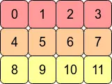

## Contiguous

在Pytorch中，contiguous 指的是Tensor的实际存储顺序与逻辑顺序是否一致。在讲解contiguous之前，我们有必要了解一下实际存储顺序与逻辑顺序。

### Tensor实际存储顺序

Pytorch的底层是C实现的，因此其存储顺序也和C语言一样，是行优先的。如下图所示，Tensor的存储是行优先存储的。对于更高纬度的tensor，比如（2， 3， 4）我们也是行优先，从最后一个维度开始，最后一个维度的所有元素在同一行。
```python
t = torch.arange(12).reshape(3,4)

t
tensor([[ 0,  1,  2,  3],
        [ 4,  5,  6,  7],
        [ 8,  9, 10, 11]])
```



### Tensor的逻辑顺序

当你创建了一个 Tensor，它在物理内存上是一条线（一维连续数组），但在逻辑上它是高维的。这全靠以下 2 个变量来完成“从一维到高维”的逻辑映射：

- shape: 举个例子，shape 为 (2, 3, 4)，它规定了逻辑上有 3 个轴（Axes），每个轴能容纳多少个元素。
- strides: 表示在逻辑上的某个维度前进 1 步，在物理内存中需要跨过多少个元素。比如(2, 3, 4) Tensor，其 stride 是 (12, 4, 1)。strides大小取决于当前位置往后的所有维度的乘积，好比 3 * 4
  

我们经常会使用一些 API 来改变tensor的shape，具体来说他们也有一些差异：transpose 和 permute并不会改变tensor的实际存储顺序，只会交换tensor的shape和strides，因此会导致tensor的存储顺序与逻辑顺序不一致，造成not contiguous。举个例子，你对上面的tensor做一个转置，那么tensor的顺序就变成了\[[0, 4, 8], [1, 5, 9], ....], 显然0， 4， 8的顺序是不连续的（访问的元素并不是连续存储）。而view操作则是重新划分维度，比如将(3， 4)的tensor视为(2, 6)。该操作要求tensor必须连续，他会重新设置新的strides。reshape操作比较万金油, 在 not contiguous 的情况下，他会直接调用contiguous整理tensor的存储位置，使之连续。

```python
transpose(dim0, dim1)
permute(*dims)
view(*shape)
reshape(*shape)
```
### 总结
contiguous 其实就是 pytorch 对tensor的实际存储与逻辑存储之间关系的一个设定，之所以会有该问题，是因为pytorch在某些API中，为了效率考虑，没有真正修改tensor实际存储状态。我们在使用相关API的时候要注意，在not contigusouu的情况下，调用contiguous()重新排列tensor。


## F.log_softmax


log_softmax 做的事情可以拆解为两步：先做 Softmax 转化为概率分布，再取 Log（对数）。但在工程实现上，为了防止数值溢出，它采用了一种非常精妙的数学变形。

假设模型对某一个 Token 位置输出的 Logits 向量为 $x = [x_1, x_2, \dots, x_V]$（其中 $V$ 是词表大小 vocab_size，通常是几万到十几万）。

$$P(x_i) = \text{Softmax}(x_i) = \frac{e^{x_i}}{\sum_{j} e^{x_j}}$$

$$\log(P(x_i)) = \log \left( \frac{e^{x_i}}{\sum_{j} e^{x_j}} \right)$$


$$\log(P(x_i)) = \log(e^{x_i}) - \log \left( \sum_{j} e^{x_j} \right) = x_i - \log \left( \sum_{j} e^{x_j} \right)$$

### 与直接softmax + log有何区别 ？

- overflow

如果大模型输出的 Logits 里有比较大的数（例如某个词的 Logit 是 $85$），在算 Softmax 分母的 $e^{85}$ 时，这个值约为 $8.2 \times 10^{36}$。如果使用的是半精度（Float16/BFloat16），Float16 能表示的最大数只有 $65504$。分母直接断开变成了 inf（无穷大）。

- underflow

如果某个不相关的词 Logit 比较小，Softmax 算出来的概率极其接近 0（比如 $10^{-50}$），在 Float16 下它会被直接截断强制等于 0.0。接下来在做 torch.log(0.0) 时，数学上 $\log(0) = -\infty$，这会导致后续的 Loss 变成 NaN。

### 工程上的技巧


$$\log\_softmax(x_i) = x_i - \log \left( \sum_{j} e^{x_j} \right)$$

$$\log \left( \sum_{j} e^{x_j} \right) = x_{max} + \log \left( \sum_{j} e^{x_j - x_{max}} \right)$$

所以底层实际计算的是：

$$\log\_softmax(x_i) = (x_i - x_{max}) - \log \left( \sum_{j} e^{x_j - x_{max}} \right)$$


- 绝对不会上溢：因为每个 $x_j$ 都减去了 $x_{max}$，所以所有的指数项 $x_j - x_{max} \le 0$。而 $e^{\le 0}$ 的范围在 $(0, 1]$ 之间，Float16 永远不会溢出。
- 极难发生下溢：这组数里面至少有一个数（最大值自己）减去 $x_{max}$ 后等于 0，而 $e^0 = 1$。这意味着求和项 sum 至少大于等于 1，取 $\log(\ge 1)$ 绝对不可能得到 $-\infty$。