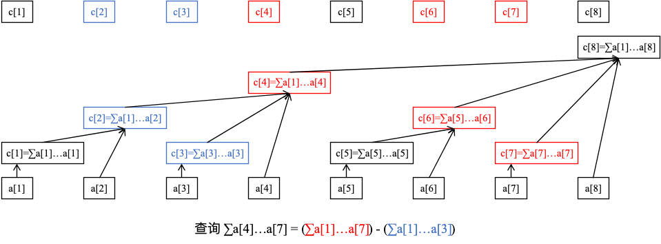

## 树状数组的优势

假设有一个长度为 $n$ 的数组，我们需要频繁地做两件事：
- 修改：把第 $i$ 个数加上一个值 $v$（单点修改）。
- 查询：算一算前 $i$ 个数的总和是多少（前缀和查询）。

普通数组：修改 $O(1)$，但求前缀和需要遍历，复杂度 $O(n)$。

前缀和数组：查前缀和 $O(1)$，但一旦修改了第 $1$ 个数，后面所有的前缀和都要跟着改，修改复杂度 $O(n)$。

树状数组则是两者的完美平衡，它能做到修改 $O(\log n)$，查询 $O(\log n)$。
·


### 树状数组原理


树状数组的本质，就是把一个大区间拆分成若干个长度为 2 的幂次的小区间。

我们用一个数组 C 来作为树状数组。C[i] 并不只存储原数组 A[i] 的值，而是存储某一段区间的和。具体是哪一段？这取决于 $i$ 的二进制表示。规则如下：C[i] 负责管理的区间长度，等于 $i$ 的二进制表示中 最低位的 1 及其后面的 0 组成的数值（这个东西叫 lowbit）。举个例子：
- $4$ 的二进制是 $(100)_2$，最低位的 1 带上后面的 0 是 $(100)_2 = 4$。所以 C[4] 管理的区间长度是 4，它存储的是 $A[1] + A[2] + A[3] + A[4]$。
- $6$ 的二进制是 $(110)_2$，最低位的 1 带上后面的 0 是 $(10)_2 = 2$。所以 C[6] 管理的区间长度是 2，它存储的是 $A[5] + A[6]$。
- $7$ 的二进制是 $(111)_2$，最低位的 1 是 $(1)_2 = 1$。所以 C[7] 只管理它自己，存储的是 $A[7]$。


### lowbit操作

lowbit是获得元素最低位的操作，其公式为： $$lowbit(x)  = x \ \& \ (-x)$$

example:
- $6 = (1001)_2$
- $-x$：$(1010)_2$
- $x \ \& \ (-x)$：$(0110)_2 \ \& \ (1010)_2 = (0010)_2 = 2$。

### Implement of Binary Indexed Tree

#### Update an element $update(x, delta)$

This operation updates a value (delta) to the element at index x. And then update all the  responsible intervals (C).


When an element changes, its effect ripples upwards to its ancestor nodes in the tree structure. To find the next responsible interval that needs to be updated, you repeatedly add lowbit(i) to the current index $i$ until you exceed the array size $n$.


```cpp

void update(int x, int delta) {
    for (int i = x; i <= n; i += lowbit(i)) {
        C[i] += delta;
    }
}
```


#### Prefix sum query $query(x)$

This operation calculates the prefix sum of the elements from the beginning of the array up to index $x$ (i.e., $\sum_{i=1}^{x} A[i]$).


To get the total sum up to $x$, the algorithm breaks down the range $[1, x]$ into a few predefined sub-intervals stored in the BIT. It accumulates the value of C[i] and then subtracts lowbit(i) from the current index $i$ to move to the next independent sub-interval, repeating this process until $i$ becomes $0$.

```cpp
int query(int x) {
    int sum = 0;
    for (int i = x; i > 0; i -= lowbit(i)) {
        sum += C[i];
    }
    return sum;
}
```

#### example of BIT




### Proval of BIT

To understand why the `lowbit` operations work flawlessly without leaving gaps or overlapping.
Here is the formal proof and intuition behind why the Query and Update operations perfectly cover the required intervals.

#### What does $C[x]$ actually hold?

By definition, the interval managed by $C[x]$ is:


$$\text{Interval}(x) = (x - \text{lowbit}(x), x]$$

This means $C[x]$ stores the sum of $\text{lowbit}(x)$ elements, ending exactly at $x$.

#### Why Query (`x -= lowbit(x)`) is Correct and Complete

When we query the prefix sum of $x$, we want to cover the range $(0, x]$.

1. We start at $x$. The current node $C[x]$ covers $(x - \text{lowbit}(x), x]$.
2. To collect the remaining sum, we must look at the range $(0, x - \text{lowbit}(x)]$.
3. Therefore, the next index we need to inspect is exactly $x' = x - \text{lowbit}(x)$.


---

#### Why Update (`x += lowbit(x)`) Covers Exactly the Right Intervals

When we update an element at index $x$, we need to update *every* index $y$ such that $y > x$ and $x$ falls inside $y$'s interval. That is:


$$y - \text{lowbit}(y) < x \le y$$

We need to prove that the sequence generated by $x_{i+1} = x_i + \text{lowbit}(x_i)$ yields **all** such valid $y$ values, without missing any and without adding extras.


Let’s write $x$ in binary, isolating its trailing zeros:


$$x = \dots0\underbrace{11\dots1}_{m \text{ ones}}\underbrace{00\dots0}_{k \text{ zeros}}$$


*(Note: There can be zero or more $1$s in the block of $m$, but it must be preceded by a $0$ unless it's the highest bit).*

From this, $\text{lowbit}(x) = 2^k$.

When we execute `x += lowbit(x)`, the addition of $2^k$ will carry through all the trailing $1$s until it hits the first $0$ from the right:


$$x_{\text{next}} = x + \text{lowbit}(x) = \dots1\underbrace{00\dots0}_{m \text{ zeros}}\underbrace{00\dots0}_{k \text{ zeros}}$$

Now let's verify if $x$ is covered by $x_{\text{next}}$:

1. What is $\text{lowbit}(x_{\text{next}})$? It is $2^{k+m+1}$ (since the $0$ flipped to $1$).
2. The left bound of $x_{\text{next}}$'s interval is:

$$x_{\text{next}} - \text{lowbit}(x_{\text{next}}) = \dots0\underbrace{00\dots0}_{m \text{ zeros}}\underbrace{00\dots0}_{k \text{ zeros}}$$


3. Comparing this left bound with our original $x$:

$$\dots000\dots000 < (\dots011\dots100) \le \dots100\dots000$$


$$x_{\text{next}} - \text{lowbit}(x_{\text{next}}) < x \le x_{\text{next}}$$


This proves that $x_{\text{next}}$ **definitely covers** $x$.


Could there be an integer $y$ between $x$ and $x_{\text{next}}$ that also covers $x$?

For any $y$ strictly between $x$ and $x_{\text{next}}$ ($x < y < x_{\text{next}}$), $y$ must share the same prefix as $x_{\text{next}}$ up to the flipped bit, but must have a $1$ somewhere in the lower bits. This implies that $\text{lowbit}(y)$ will be smaller than $2^{k+m+1}$, meaning its interval length is too short to reach backward and cover $x$.

Thus, $x + \text{lowbit}(x)$ finds the **immediate next larger interval** that contains $x$. By repeating this process, we traverse up the chain of direct ancestors in the tree structure, ensuring every single affected interval is updated with zero redundancy.